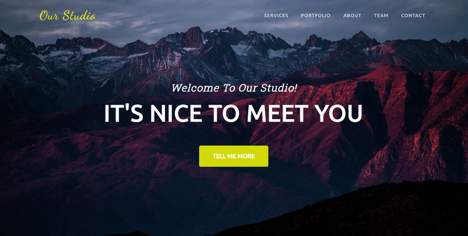
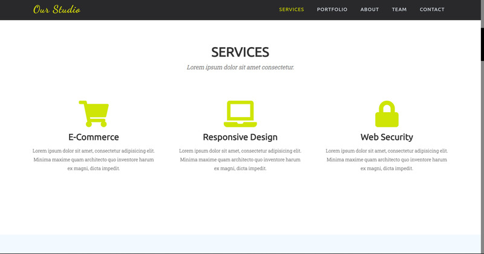
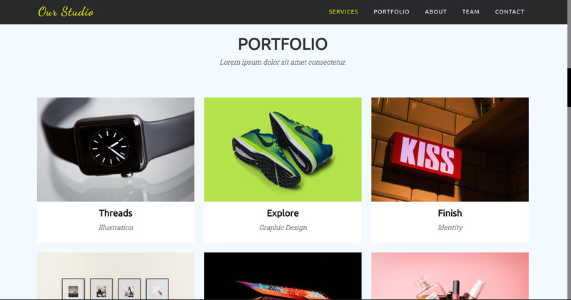
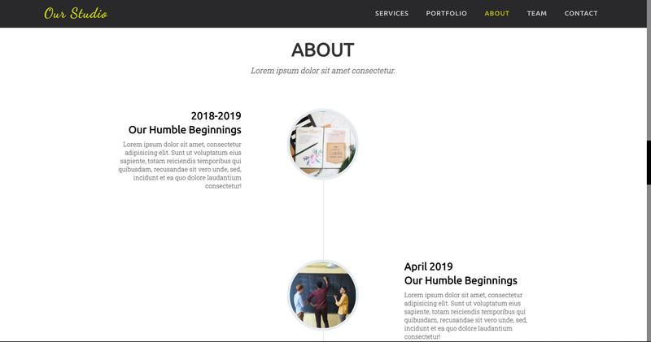
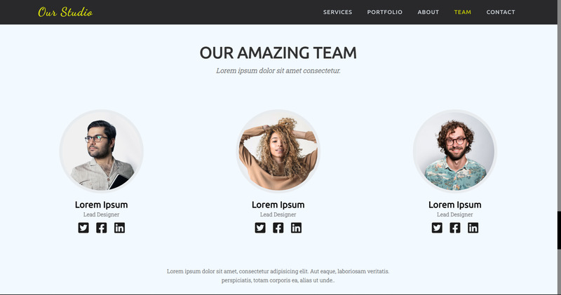
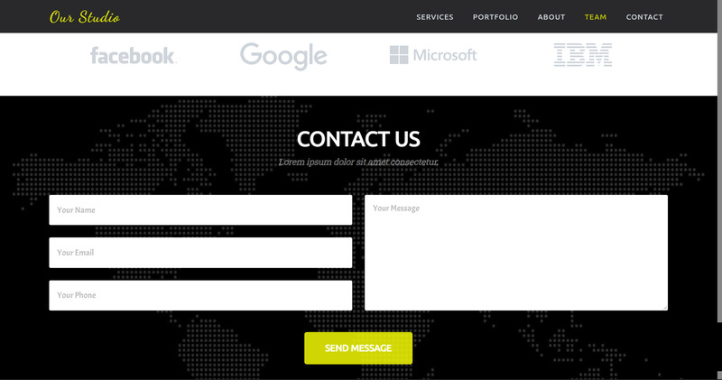

# EhsanShahbazii.github.io
This repository  just used for show preview live of Our-Studio pages.

## Hi:wave:
	
  This is my first simple front-end project in github:relaxed:. I made this project to practice **HTML**, **CSS** & a little **JavaScript**:rocket:. 
but it isn't responsive yet:sleepy:. After a while, i will start make responsive this site & turn **CSS** to **SASS**:muscle:.

  Back to project:smile:! I used **AOS**:fire:**library** to animate components & **fontawesome** icons. 
**I have inspired this site from another site:sweat_smile:. I tried to build it.**
 

## Preview

site consisting of:
- Main component
- Services

- Portfolio

- About

- Team

- Contact 

